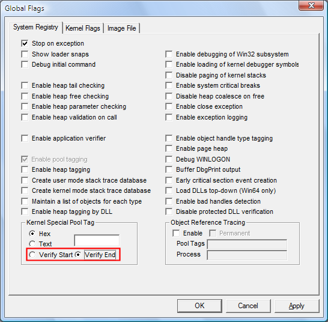

# Detecting Overruns and Underruns

## 

You can use the **Verify Start** or **Verify End** option in GFlags to align allocations from the special pool so that they are best suited to detect overruns (accessing memory past the end of the allocation) or underruns (accessing memory that precedes the beginning of the allocation).

-   **Verify Start** enables underrun detection on allocations from the special pool. This causes a bug check when a program tries to access memory preceding its special pool memory allocation.

-   **Verify End** enables overrun detection on allocations from the special pool. This causes a bug check when a program tries to access memory beyond its special pool memory allocation. Because overruns are much more common, **Verify End** is the default.

In Windows Vista and later versions of Windows, this option is available on the **System Registry** and **Kernel Flags** tabs. In earlier versions of Windows, it is available only on the **System Registry** tab.

**To specify special pool alignment**

1.  Click the **System Registry** tab.

2.  Click **Verify Start** or **Verify End**.

3.  Click **Apply**.

    The following screen shot shows the Verify Start and Verify End settings on the System **Registry** tab.

    

### Comments

The **Verify Start** and **Verify End** alignment settings apply to all allocations from the special pool, including special pool allocation requests set in Driver Verifier. If you set the alignment without specifying a pool tag or allocation size, then the settings apply only to requests set in Driver Verifier.

 

 

[Send comments about this topic to Microsoft](mailto:wsddocfb@microsoft.com?subject=Documentation%20feedback%20[debugger\debugger]:%20Detecting%20Overruns%20and%20Underruns%20%20RELEASE:%20%285/15/2017%29&body=%0A%0APRIVACY%20STATEMENT%0A%0AWe%20use%20your%20feedback%20to%20improve%20the%20documentation.%20We%20don't%20use%20your%20email%20address%20for%20any%20other%20purpose,%20and%20we'll%20remove%20your%20email%20address%20from%20our%20system%20after%20the%20issue%20that%20you're%20reporting%20is%20fixed.%20While%20we're%20working%20to%20fix%20this%20issue,%20we%20might%20send%20you%20an%20email%20message%20to%20ask%20for%20more%20info.%20Later,%20we%20might%20also%20send%20you%20an%20email%20message%20to%20let%20you%20know%20that%20we've%20addressed%20your%20feedback.%0A%0AFor%20more%20info%20about%20Microsoft's%20privacy%20policy,%20see%20http://privacy.microsoft.com/default.aspx. "Send comments about this topic to Microsoft")

