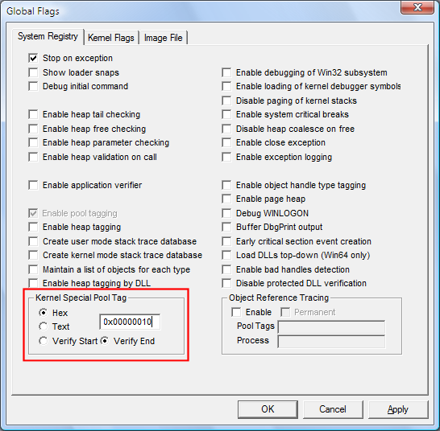

# Requesting Special Pool by Allocation Size

## 

You can request special pool for allocations within a specified size range.

In Windows Vista and later versions of Windows, you can also use the command line to request special pool by pool tag. For information, see [**GFlags Commands**](gflags-commands.md).

**Note**   This method is rarely useful for diagnosing driver errors, because it affects all kernel pool requests of the specified size, regardless of which driver or kernel module requested the allocation.

 

### To request special pool by allocation size

1.  Select the **System Registry** tab or the **Kernel Flags** tab.

    On Windows Vista and later versions of Windows, this option is available on both tabs. On earlier versions of Windows, it is available only on the **System Registry** tab.

2.  In the **Kernel Special Pool Tag** section, click **Hex**, and then type a number in hexadecimal format that represents a range of sizes. All allocations within this size range will be allocated from special pool. This number must be less than PAGE\_SIZE.

3.  Click **Apply**.

    The following screen shot shows an allocation size entered as a hexadecimal value.

    

 

 

[Send comments about this topic to Microsoft](mailto:wsddocfb@microsoft.com?subject=Documentation%20feedback%20[debugger\debugger]:%20Requesting%20Special%20Pool%20by%20Allocation%20Size%20%20RELEASE:%20%285/15/2017%29&body=%0A%0APRIVACY%20STATEMENT%0A%0AWe%20use%20your%20feedback%20to%20improve%20the%20documentation.%20We%20don't%20use%20your%20email%20address%20for%20any%20other%20purpose,%20and%20we'll%20remove%20your%20email%20address%20from%20our%20system%20after%20the%20issue%20that%20you're%20reporting%20is%20fixed.%20While%20we're%20working%20to%20fix%20this%20issue,%20we%20might%20send%20you%20an%20email%20message%20to%20ask%20for%20more%20info.%20Later,%20we%20might%20also%20send%20you%20an%20email%20message%20to%20let%20you%20know%20that%20we've%20addressed%20your%20feedback.%0A%0AFor%20more%20info%20about%20Microsoft's%20privacy%20policy,%20see%20http://privacy.microsoft.com/default.aspx. "Send comments about this topic to Microsoft")

