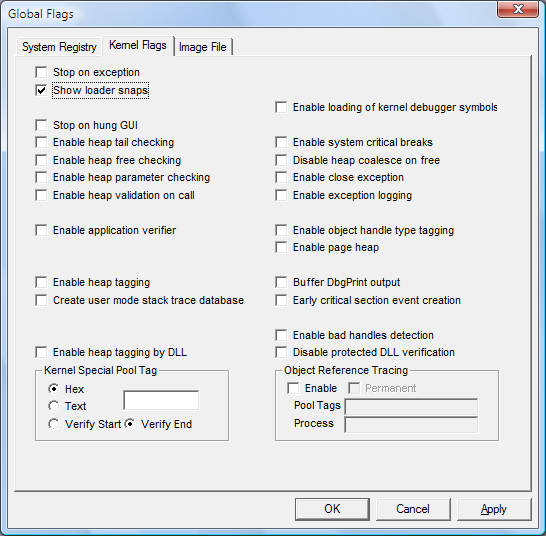

# Setting and Clearing Kernel Flags

## 

Kernel flag settings, also known as "run-time settings," affect the entire system. They take effect immediately without rebooting, but they are lost if you shut down or restart the system.

Kernel settings take precedence over registry settings during run time, but when you shut down or restart the system, the kernel flag settings are lost and the registry settings are effective again.

**To set and clear kernel flags**

1.  Click the **Kernel Flags** tab.

    The following screen shot shows the **Kernel Flags** tab in Windows Vista.

    

2.  Set or clear a flag by selecting or clearing the check box associated with the flag.

3.  When you have selected or cleared all of the flags that you want, click **Apply**.

 

 

[Send comments about this topic to Microsoft](mailto:wsddocfb@microsoft.com?subject=Documentation%20feedback%20[debugger\debugger]:%20Setting%20and%20Clearing%20Kernel%20Flags%20%20RELEASE:%20%285/15/2017%29&body=%0A%0APRIVACY%20STATEMENT%0A%0AWe%20use%20your%20feedback%20to%20improve%20the%20documentation.%20We%20don't%20use%20your%20email%20address%20for%20any%20other%20purpose,%20and%20we'll%20remove%20your%20email%20address%20from%20our%20system%20after%20the%20issue%20that%20you're%20reporting%20is%20fixed.%20While%20we're%20working%20to%20fix%20this%20issue,%20we%20might%20send%20you%20an%20email%20message%20to%20ask%20for%20more%20info.%20Later,%20we%20might%20also%20send%20you%20an%20email%20message%20to%20let%20you%20know%20that%20we've%20addressed%20your%20feedback.%0A%0AFor%20more%20info%20about%20Microsoft's%20privacy%20policy,%20see%20http://privacy.microsoft.com/default.aspx. "Send comments about this topic to Microsoft")

