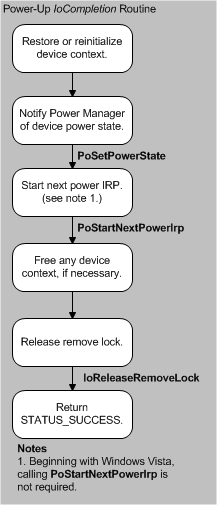

# IoCompletion Routines for Device Power IRPs

## 

After the bus driver completes the IRP, the I/O manager calls the [*IoCompletion*](https://msdn.microsoft.com/library/windows/hardware/ff548354) routines registered by higher-level drivers as they passed the IRP down the stack.

Whenever a device enters the D0 state, each of its drivers should set an *IoCompletion* routine that performs most of the tasks required to return it to the working state. Drivers should set an *IoCompletion* routine for any transition to the D0 state, whether the device is returning from a sleeping state or entering D0 at system start-up. The following figure shows the tasks such an *IoCompletion* routine should perform.

These tasks include:

-   Restoring device power state or reinitializing the device, as required, and preparing to handle any I/O queued by drivers while the device was not in the working state

-   Calling [**PoSetPowerState**](https://msdn.microsoft.com/library/windows/hardware/ff559765) to notify the power manager that the device is in the D0 power state.

-   Calling [**PoStartNextPowerIrp**](https://msdn.microsoft.com/library/windows/hardware/ff559776) to receive the next power IRP, if the driver did not originally send the current power IRP. (Windows Server 2003, Windows XP, and Windows 2000 only).

-   Freeing memory allocated for the device context.

-   Calling [**IoReleaseRemoveLock**](https://msdn.microsoft.com/library/windows/hardware/ff549560) to free the lock that the driver acquired in its [*DispatchPower*](https://msdn.microsoft.com/library/windows/hardware/ff543354) routine when it received the IRP.

-   Returning STATUS\_SUCCESS.

The bus driver does not power up the device until it or higher drivers must communicate with the device.

When its device enters a sleeping state, a driver should set an *IoCompletion* routine that calls [**PoStartNextPowerIrp**](https://msdn.microsoft.com/library/windows/hardware/ff559776) (Windows Server 2003, Windows XP, and Windows 2000 only) and releases the remove lock. Remember that a driver cannot access its device while the device is in a sleeping state.

 

 

--------------------
[Send comments about this topic to Microsoft](mailto:wsddocfb@microsoft.com?subject=Documentation%20feedback%20%5Bkernel\kernel%5D:%20IoCompletion%20Routines%20for%20Device%20Power%20IRPs%20%20RELEASE:%20%286/14/2017%29&body=%0A%0APRIVACY%20STATEMENT%0A%0AWe%20use%20your%20feedback%20to%20improve%20the%20documentation.%20We%20don't%20use%20your%20email%20address%20for%20any%20other%20purpose,%20and%20we'll%20remove%20your%20email%20address%20from%20our%20system%20after%20the%20issue%20that%20you're%20reporting%20is%20fixed.%20While%20we're%20working%20to%20fix%20this%20issue,%20we%20might%20send%20you%20an%20email%20message%20to%20ask%20for%20more%20info.%20Later,%20we%20might%20also%20send%20you%20an%20email%20message%20to%20let%20you%20know%20that%20we've%20addressed%20your%20feedback.%0A%0AFor%20more%20info%20about%20Microsoft's%20privacy%20policy,%20see%20http://privacy.microsoft.com/default.aspx. "Send comments about this topic to Microsoft")

