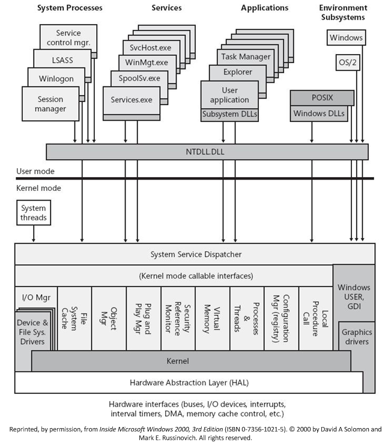

# Overview of Windows Components

## 

The following figure shows the major internal components of the Windows operating system.

As the figure shows, the Windows operating system includes both user-mode and kernel-mode components. For more information about Windows user and kernel modes, see [User Mode and Kernel Mode](https://msdn.microsoft.com/library/windows/hardware/ff554836).

Drivers call routines that are exported by various kernel components. For example, to create a device object, you would call the [**IoCreateDevice**](https://msdn.microsoft.com/library/windows/hardware/ff548397) routine which is exported by the I/O manager. For a list of kernel-mode routines that drivers can call, see [Driver Support Routines](https://msdn.microsoft.com/library/windows/hardware/ff544200).

In addition, drivers must respond to specific calls from the operating system and can respond to other system calls. For a list of kernel mode routines that drivers may need to support, see [Standard Driver Routines](https://msdn.microsoft.com/library/windows/hardware/ff563842).

Not all kernel-mode components are pictured in the figure above. For a list of kernel mode components, see [Kernel-Mode Managers and Libraries](kernel-mode-managers-and-libraries.md).

 

 

--------------------
[Send comments about this topic to Microsoft](mailto:wsddocfb@microsoft.com?subject=Documentation%20feedback%20%5Bkernel\kernel%5D:%20Overview%20of%20Windows%20Components%20%20RELEASE:%20%286/14/2017%29&body=%0A%0APRIVACY%20STATEMENT%0A%0AWe%20use%20your%20feedback%20to%20improve%20the%20documentation.%20We%20don't%20use%20your%20email%20address%20for%20any%20other%20purpose,%20and%20we'll%20remove%20your%20email%20address%20from%20our%20system%20after%20the%20issue%20that%20you're%20reporting%20is%20fixed.%20While%20we're%20working%20to%20fix%20this%20issue,%20we%20might%20send%20you%20an%20email%20message%20to%20ask%20for%20more%20info.%20Later,%20we%20might%20also%20send%20you%20an%20email%20message%20to%20let%20you%20know%20that%20we've%20addressed%20your%20feedback.%0A%0AFor%20more%20info%20about%20Microsoft's%20privacy%20policy,%20see%20http://privacy.microsoft.com/default.aspx. "Send comments about this topic to Microsoft")

